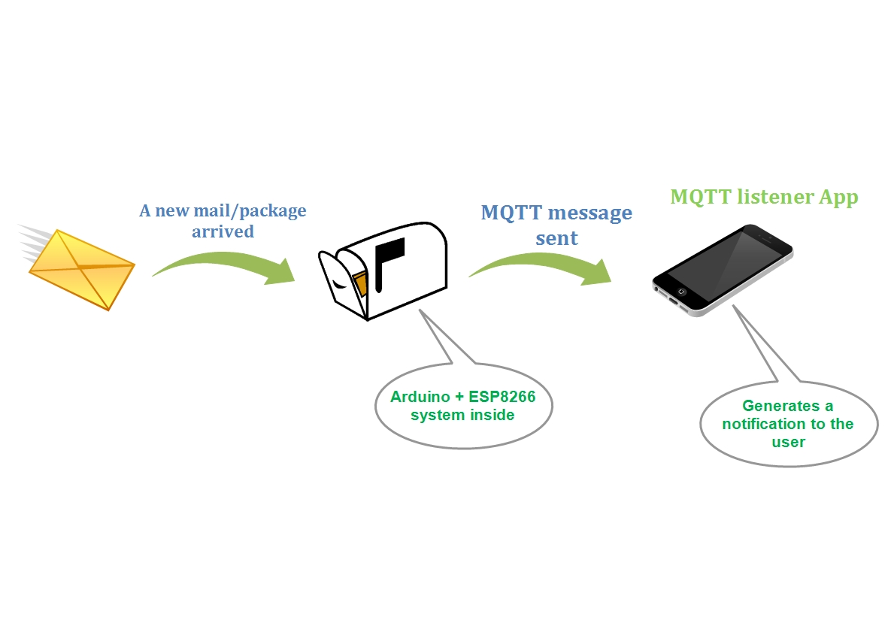

# PostNotifier
 MQTT listener, runs as a foreground service and alerts when a new mqtt message has arrived

* A stand-alone Low Power real time mail and packages notification system. 
* Based on Arduino Nano and ESP8266 micro-controllers
* This app used to notify user by getting a new MQTT message from the system when a new mail or package arrived to my physical mailbox.
* This Repository is the Android application code only, the arduino code and the ESP8299 code will be uploaded separately!
* The Arduino mini pro used to achieve a LOW POWER - 6uA current while sleeping. better than the batteries self discharge!

## App screenshots

## Overview

## External look

## System scheme

