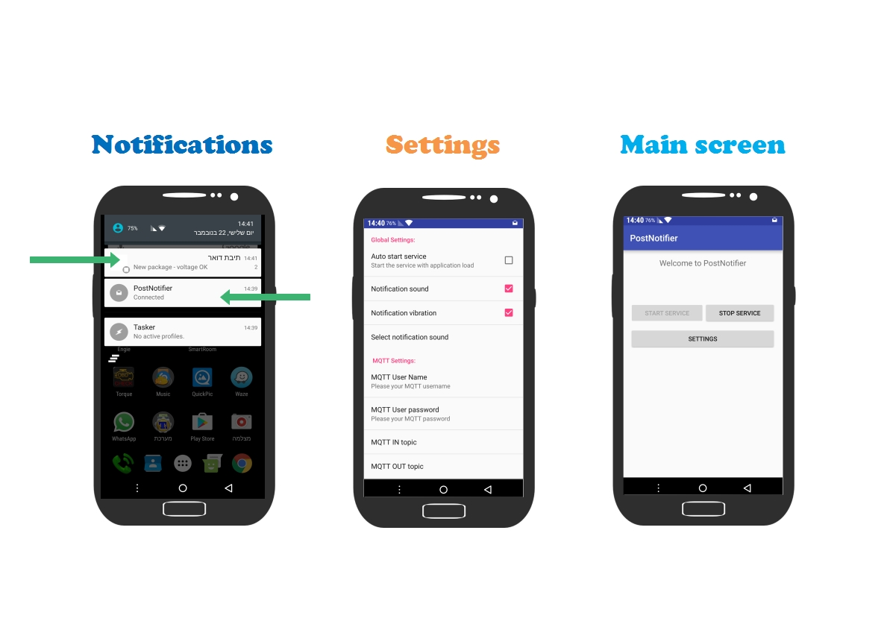
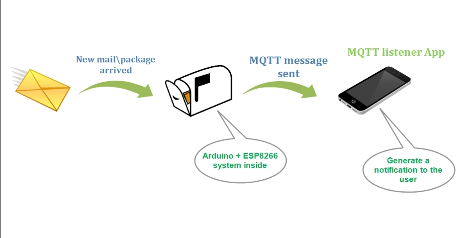
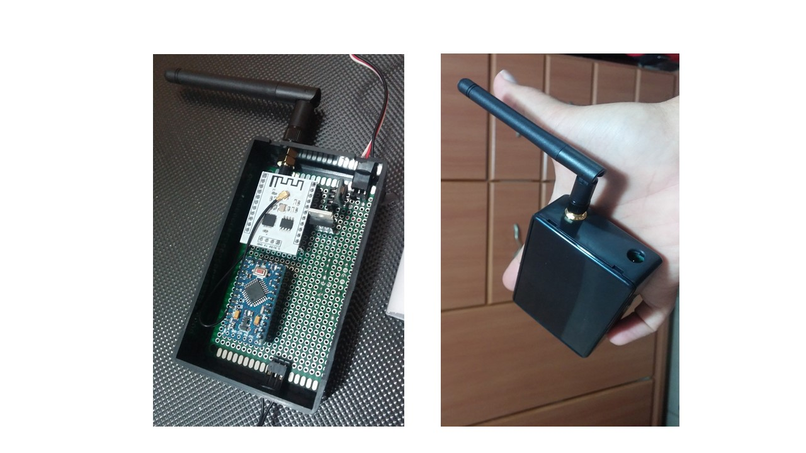
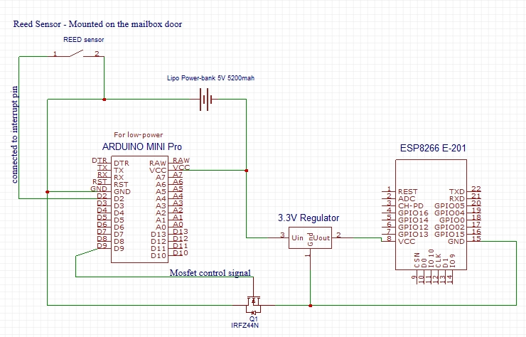

# PostNotifier
 MQTT listener, runs as a foreground service and alerts when a new mqtt message arrived

* This app used to notify me when a new mail or package arrived to my physical mailbox.
* This Repository is the Android application code only, the arduino code and the ESP8299 code will be uploaded separately!
* The Arduino mini pro used to achieve a LOW POWER - 6uA current while sleeping. better than the batteries self discharge!

## App screens

## Over view

## External look

## System scheme

